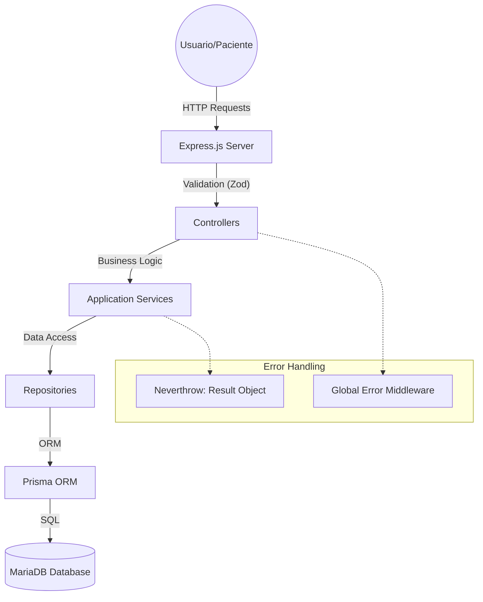

# 🏥 Clínica Angel - Sistema de Autogestión y Turnos


Plataforma integral enfocada en la **autogestión de pacientes** y la **administración eficiente** de turnos médicos. Este sistema ha sido diseñado bajo principios de Arquitectura Limpia, priorizando la robustez mediante validación estricta y manejo funcional de errores.

---

## 🏗️ Arquitectura del Sistema

El proyecto sigue una estructura modular basada en dominios, facilitando la escalabilidad y el mantenimiento.



---

## 📁 Estructura del Proyecto

Organización inspirada en los principios de "Screaming Architecture", donde la estructura revela la intención del sistema:

```text
src/
├── _assets/          # Recursos estáticos (CSS, JS cliente, imágenes)
├── _shared/          # Código compartido (Errores, Middleware, Layouts)
│   ├── application/  # Lógica de aplicación transversal
│   ├── infrastructure/ # Implementaciones técnicas (Env, DB config)
│   └── views/        # Plantillas base y componentes compartidos
├── [modulo]/         # Módulos por dominio (auth, patients, schedules, etc.)
│   ├── domain/       # Entidades e interfaces de repositorio
│   ├── application/  # Casos de uso y servicios del dominio
│   ├── infrastructure/ # Rutas, Controladores e implementaciones Prisma
│   └── views/        # Plantillas Nunjucks específicas del dominio
├── app.js            # Configuración principal de Express
└── server.js         # Entry point del servidor
```

---

## 🚀 Excelencia Técnica

Para garantizar un código de grado industrial, implementamos:

- **Validación Estricta (Zod):** Todo dato externo (Request Body, Env Vars) es validado contra esquemas rígidos antes de entrar al dominio.
- **Manejo Funcional de Errores (Neverthrow):** Eliminamos el uso de `try/catch` para lógica de negocio, utilizando objetos `Result` que fuerzan el manejo de errores de forma explícita y tipada.
- **Manejo Seguro de Sesiones:** Autenticación mediante JWT con almacenamiento persistente en cookies `HttpOnly` y `Secure`.
- **UI Reactiva:** Vistas rápidas mediante Nunjucks (SSR) potenciadas con TailwindCSS y DaisyUI para una experiencia premium.

---

## 🔧 Configuración y Despliegue

### Requisitos Previos

- **Node.js**: v20.19.6+
- **Database**: MariaDB / MySQL (XAMPP recomendado)
- **Gestor de Paquetes**: `pnpm` (recomendado)

### Variables de Entorno (.env)

| Variable                  | Descripción                        | Ejemplo                                      |
| :------------------------ | :--------------------------------- | :------------------------------------------- |
| `PORT`                    | Puerto de escucha                  | `3000`                                       |
| `MYSQL_CONNECTION_STRING` | URL de conexión Prisma             | `mysql://root:@localhost:3306/clinica_angel` |
| `JWT_SECRET`              | Secreto para tokens (Min 32 chars) | `tu_secreto_super_seguro_minimo_32`          |
| `JWT_EXPIRES`             | Tiempo de expiración del token     | `1h`, `7d`                                   |

### Pasos de Instalación

1. **Clonar e Instalar:**

   ```bash
   git clone https://github.com/EmanuelAngel/clinica-angel.git
   cd clinica-angel
   pnpm install
   ```

2. **Base de Datos:**

   ```bash
   cp .env.example .env
   # Ajustar credenciales en .env
   npx prisma migrate dev
   pnpm run db:seed
   ```

3. **Ejecución:**
   ```bash
   pnpm run css:build # Generar output.css
   pnpm run dev       # Modo desarrollo con Nodemon
   ```

---

## 🧪 Testing y Calidad

Mantenemos la integridad del sistema mediante:

- **Integration Tests:** Pruebas de extremo a extremo en rutas críticas.
- **Unit Tests:** Validación de lógica de servicios y utilidades.
- **Linting & Formatting:** Reglas estrictas con ESLint y Prettier.

```bash
pnpm run test         # Ejecutar suite completa
pnpm run test:cov     # Reporte de cobertura
pnpm run lint         # Análisis estático
```

---

## 👨‍💻 Autor

- **Angel Emanuel** - _Desarrollo Fullstack_ - [GitHub](https://github.com/EmanuelAngel)

---

_Proyecto desarrollado para Laboratorio 2 - Universidad de La Punta, San Luis, Argentina._
