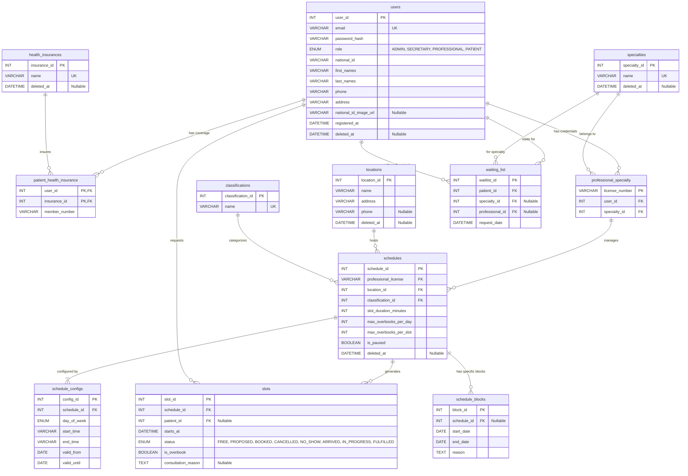

# Clínica Angel — Sistema de Gestión de Turnos


Proyecto universitario para la asignatura **Laboratorio 2** (Universidad de La Punta, San Luis, Argentina). Es un sistema de gestión de turnos médicos que permite a pacientes autogestionar sus reservas y a la administración gestionar agendas, profesionales y coberturas médicas.

El stack fue impuesto en parte por la cátedra (Node.js, Express, MariaDB, motor de plantillas SSR) y complementado con decisiones propias documentadas en los [ADRs](./docs/adr/).

---

## Arquitectura

Monolito con SSR. La estructura interna sigue un **Vertical Slicing por módulo de dominio** con influencia de Clean Architecture: cada feature (`users`, `patients`, `schedules`, `slots`, etc.) tiene sus propias capas de dominio, aplicación, infraestructura y vistas. No hay microservicios ni separación frontend/backend — todo convive en el mismo proceso Node.js.

```
src/
├── _shared/          # Código transversal (errores, middleware, layouts base)
├── [modulo]/         # Un directorio por dominio
│   ├── domain/       # Entidades y contratos de repositorio (JSDoc)
│   ├── application/  # Servicios y casos de uso
│   ├── infrastructure/ # Controllers, routes, repositorios Prisma
│   └── views/        # Templates Nunjucks del módulo
├── app.js            # Setup de Express
└── server.js         # Entry point
```

El flujo por request es siempre: `Router → Controller → Service → Repository → Prisma`. Los servicios retornan `Result<T, E>` usando `neverthrow`; los errores fatales se propagan al `globalErrorHandler` de Express.

---

## Decisiones de Arquitectura

Cada decisión de diseño relevante está documentada como un ADR en [`docs/adr/`](./docs/adr/). El resumen:

| ADR | Decisión | Alternativa descartada |
|-----|----------|----------------------|
| [001](./docs/adr/0001-interaccion-con-persistencia-de-datos.md) | Prisma como ORM | `mysql2` (driver base) |
| [002](./docs/adr/0002-motor-de-plantillas-ssr.md) | Nunjucks como motor de plantillas | EJS, Handlebars, Pug |
| [003](./docs/adr/0003-autenticacion-y-sesiones.md) | JWT en cookie HttpOnly | Sesiones en DB, OAuth |
| [004](./docs/adr/0004-arquitectura-de-la-aplicacion.md) | Modular Clean (Vertical Slicing) | MVC clásico |
| [005](./docs/adr/0005-manejo-de-errores-y-validacion.md) | Estrategia híbrida: `neverthrow` + excepciones | Solo excepciones |
| [006](./docs/adr/0006-configuracion-de-agendas.md) | Slots pre-generados en BD | Rule Pattern en memoria |

---

## Modelo de Datos



---

## Calidad de Código

**Tipado estático sin TypeScript** (restricción de la cátedra): se usó JSDoc para definir los contratos de repositorios y servicios, con reglas ESLint que validan que las implementaciones cumplan con las interfaces documentadas. No es equivalente a TypeScript, pero captura los errores más comunes en tiempo de edición y en CI.

**Pre-commit automatizado:** husky + lint-staged ejecutan ESLint y Prettier antes de cada commit; commitlint fuerza el formato Conventional Commits.

**Tests:** integración con Jest + Supertest contra una base de datos de test real, más unit tests para lógica de dominio pura (máquina de estados de turnos, filtros de templates). 84.5% de cobertura de statements sobre el código de aplicación.

---

## Ejecución local

**Requisitos:** Node.js v22+, MariaDB/MySQL, pnpm.

```bash
# 1. Instalar dependencias
pnpm install

# 2. Configurar entorno
cp .env.example .env
# Editar .env con las credenciales de la base de datos

# 3. Migrar la base de datos
pnpm exec prisma migrate dev

# 4. Seed inicial (opcional)
pnpm run db:seed

# 5. Compilar CSS y arrancar
pnpm run css:build
pnpm run dev
```

### Variables de entorno

| Variable | Descripción | Ejemplo |
|----------|-------------|---------|
| `PORT` | Puerto de escucha | `3000` |
| `MYSQL_CONNECTION_STRING` | URL de conexión Prisma | `mysql://root:@localhost:3306/clinica_angel` |
| `JWT_SECRET` | Secreto para firmar tokens (mín. 32 chars) | — |
| `JWT_EXPIRES` | Duración del token | `1h`, `7d` |

---

## Testing

```bash
pnpm test          # Suite completa
pnpm test:cov      # Con reporte de cobertura
pnpm lint:fix      # ESLint + Prettier
```

---

## Documentación

- 📋 [Especificaciones, requerimientos, alcance y límite, casos de uso, etc](https://app.notion.com/p/Cl-nica-Angel-27a4f18b391c804f82f6c881ffeb87d2) — Notion
- 🏛️ [Decisiones de arquitectura (ADRs)](./docs/adr/) — en este repositorio

---

_Desarrollado por [Emanuel Angel](https://github.com/EmanuelAngel) — Universidad de La Punta, San Luis, Argentina._
