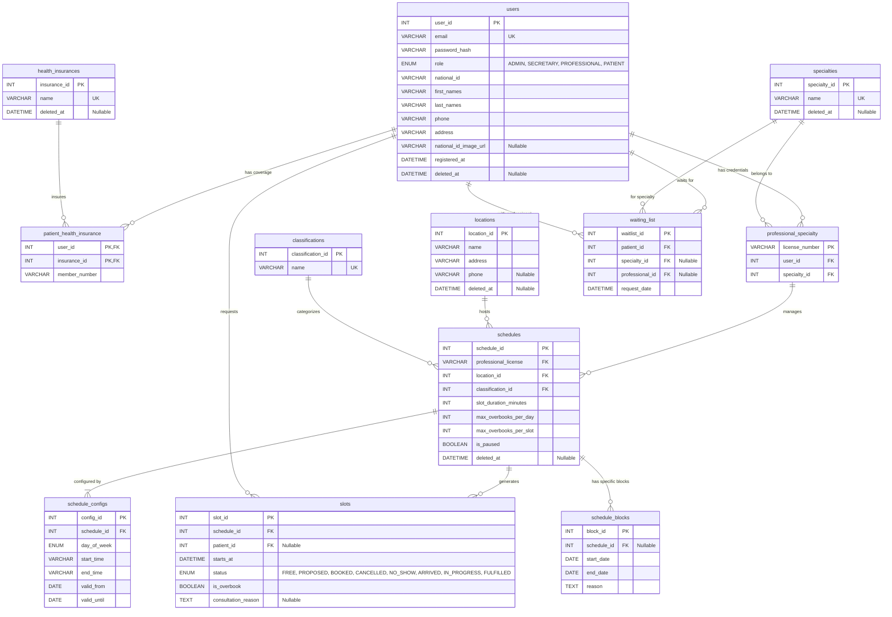

```mermaid
erDiagram
    users {
        INT user_id PK
        VARCHAR email "UK"
        VARCHAR password_hash
        ENUM role "ADMIN, SECRETARY, PROFESSIONAL, PATIENT"
        VARCHAR national_id
        VARCHAR first_names
        VARCHAR last_names
        VARCHAR phone
        VARCHAR address
        VARCHAR national_id_image_url "Nullable"
        DATETIME registered_at
        DATETIME deleted_at "Nullable"
    }
    %% Note: users has UNIQUE(national_id, role)

    health_insurances {
        INT insurance_id PK
        VARCHAR name "UK"
        DATETIME deleted_at "Nullable"
    }

    patient_health_insurance {
        INT user_id PK, FK
        INT insurance_id PK, FK
        VARCHAR member_number
    }

    specialties {
        INT specialty_id PK
        VARCHAR name "UK"
        DATETIME deleted_at "Nullable"
    }

    professional_specialty {
        VARCHAR license_number PK
        INT user_id FK
        INT specialty_id FK
    }

    locations {
        INT location_id PK
        VARCHAR name
        VARCHAR address
        VARCHAR phone "Nullable"
        DATETIME deleted_at "Nullable"
    }

    classifications {
        INT classification_id PK
        VARCHAR name "UK"
    }

    schedules {
        INT schedule_id PK
        VARCHAR professional_license FK
        INT location_id FK
        INT classification_id FK
        INT slot_duration_minutes
        INT max_overbooks_per_day
        INT max_overbooks_per_slot
        BOOLEAN is_paused
        DATETIME deleted_at "Nullable"
    }

    schedule_configs {
        INT config_id PK
        INT schedule_id FK
        ENUM day_of_week
        VARCHAR start_time
        VARCHAR end_time
        DATE valid_from
        DATE valid_until
    }

    schedule_blocks {
        INT block_id PK
        INT schedule_id FK "Nullable"
        DATE start_date
        DATE end_date
        TEXT reason
    }

    slots {
        INT slot_id PK
        INT schedule_id FK
        INT patient_id FK "Nullable"
        DATETIME starts_at
        ENUM status "FREE, PROPOSED, BOOKED, CANCELLED, NO_SHOW, ARRIVED, IN_PROGRESS, FULFILLED"
        BOOLEAN is_overbook
        TEXT consultation_reason "Nullable"
    }

    waiting_list {
        INT waitlist_id PK
        INT patient_id FK
        INT specialty_id FK "Nullable"
        INT professional_id FK "Nullable"
        DATETIME request_date
    }
    %% Note: waiting_list has UNIQUE(patient_id, professional_id, specialty_id)

    %% Relationships
    users ||--o{ patient_health_insurance : "has coverage"
    health_insurances ||--o{ patient_health_insurance : "insures"

    users ||--o{ professional_specialty : "has credentials"
    specialties ||--o{ professional_specialty : "belongs to"

    professional_specialty ||--o{ schedules : "manages"
    locations ||--o{ schedules : "hosts"
    classifications ||--o{ schedules : "categorizes"

    schedules ||--|{ schedule_configs : "configured by"
    schedules ||--o{ schedule_blocks : "has specific blocks"
    schedules ||--o{ slots : "generates"

    users ||--o{ slots : "requests"
    users ||--o{ waiting_list : "waits for"
    specialties ||--o{ waiting_list : "for specialty"
    users ||--o{ waiting_list : "with professional"
```
